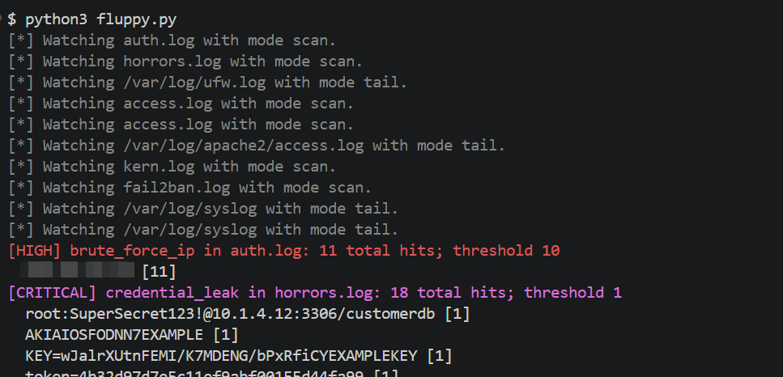
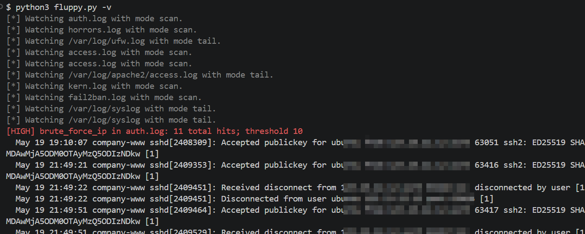

# FLUPPY DOG!

```
    @@@@@@@@ @@@      @@@  @@@ @@@@@@@  @@@@@@@  @@@ @@@
    @@!      @@!      @@!  @@@ @@!  @@@ @@!  @@@ @@! !@@
    @!!!:!   @!!      @!@  !@! @!@@!@!  @!@@!@!   !@!@!
    !!:      !!:      !!:  !!! !!:      !!:        !!:
    :        : ::.: :  :.:: :   :        :         .:
```

## About

**fluppy** is a log tailing tool to identify patterns. It takes a YAML file, and a set of configurations within. fluppy attempt to be a "log watcher" for as many files as you can source. fluppy's main goal is to watch a number of files, and alert on patterns that you identify. 

fluppy generates "alerts" to standard out, rating them to a severity which you can specify. The idea here is that you might want to alert that someone is port scanning you or that segfaults are occurring in `kern.log`. fluppy has two modes currently, a "tail" mode to watch files in realtime, and a "scan" mode to hunt files that you want to search. 

Here are some screenshots of fluppy in action (some information is totally contrived, and others have been redacted to protect the guilty).


Also, fluppy defines alert thresholds and a cooldown period so as not to spam output constantly. 

### Use Cases

- Watch your firewall and your auth log at the same time
- Monitor you super special custom binary for segfaults
- Function like a cheap one-script IDS
- Alert on secrets in files acting like a cheezy DLP
- Hunt your proxy logs for sensitive details or flaws

Currently, fluppy takes regular expressions which are then used to process logs (or really, any text file) for patterns. An example use-case might be to watch an Apache HTTP log for attacks, or to monitor a file for sensitive information. 

## Installation

Most of fluppy is pure Python, but you need to install `PyYAML`. You can likely get this working via `pip3 install PyYAML`. 

Note that on some distros and operating systems (like OSX), you might need a virtual environment as some systems won't let you "break system packages" any longer. If that sounds like you, or if you just want to do a virtual environment, you can follow these steps:

```        
$ python3 -m venv venv
$ source venv/bin/activate
$ python3 -m pip install PyYAML
```
At that point, fluppy should work for you. 


After you have downloaded the tool and configured a YAML file, running it is simple.



Alternatively, the `-v` switch outputs more verbosely outputting recent lines matching the defined pattern.



## Running fluppy

You will need to create a YAML file with your rules. Rules look like the example below. In the example below, there is a "tail", which is a live following of the `access.log`, and a "scan" mode which simply searches the contents of a `kern.log` within proximity of the fluppy tool. 

```yaml
  - path: /var/log/apache2/access.log
    mode: tail
    rules:
      - name: http_live_attack
        regex: '((\d{1,3}\.){3}\d{1,3})'
        threshold: 10
        cooldown: 3
        window: 3
        severity: high

  - path: kern.log
    mode: scan
    rules:
      - name: segfault_monitor
        regex: '(segfault at)'
        threshold: 1
        cooldown: 300
        window: 1
        severity: critical
```

Essentially, create the stanzas that you want, add a regular expression, a file source, and run fluppy.

YAML Term|Purpose
---------|-------
path|This is the path to a file. It can be local to fluppy, or a full file path.
mode|**tail**: Live following of a source file (like the Unix "tail" utility)</br>**scan**: Search an existing dead file for patterns. 
rules|**name**: The rule name for your alert.<br/>**regex**: Configure the regular expression to search your files for. <br/>**cooldown**: The period of time in seconds that the tool should wait before alerting you again.<br/>**window**: The window of time that the tool should count events for. <br/>**threshold**: The number of events that should be counted within the **window**.<br/>**severity**: Currently expects severities like `critical`, `high`, `medium`, `low`, and `info`. These are used simply as color coding events streeamed to the console. 

## About the name

Fluppy dogs have tails, and `tail` is pretty ubiqitous as a tool for "tailing" logs. Also I call my dog "fluppy dog" all the time, which is a portmanteau of "fluffy" and "puppy". You get it now.


