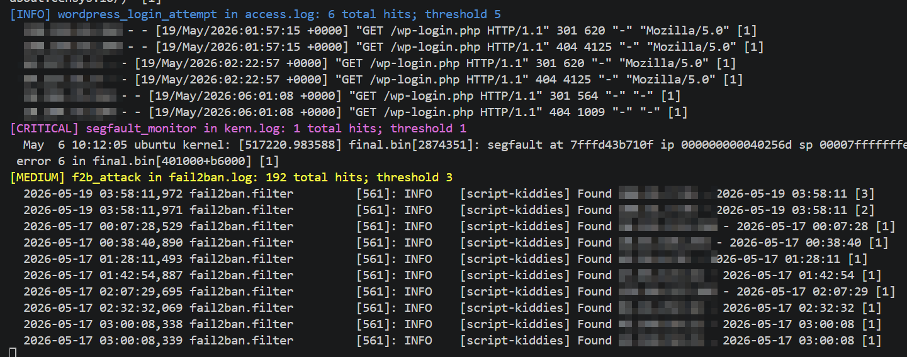
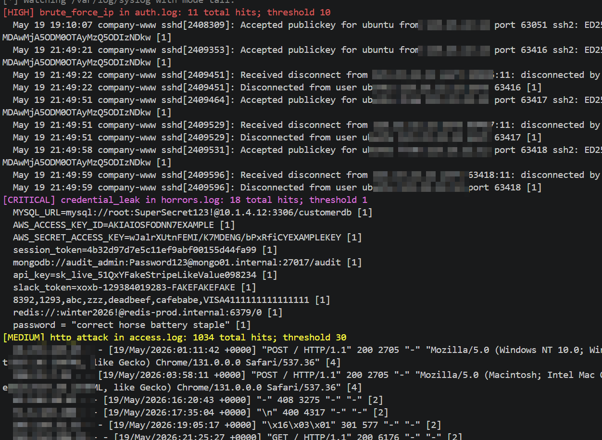
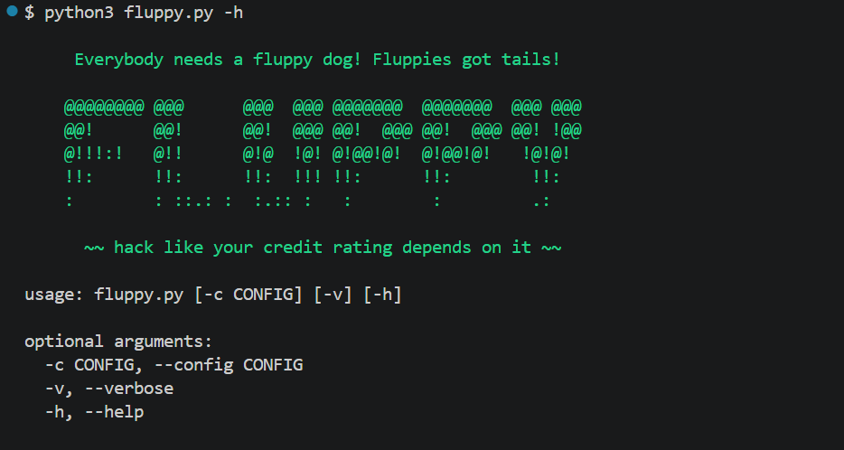
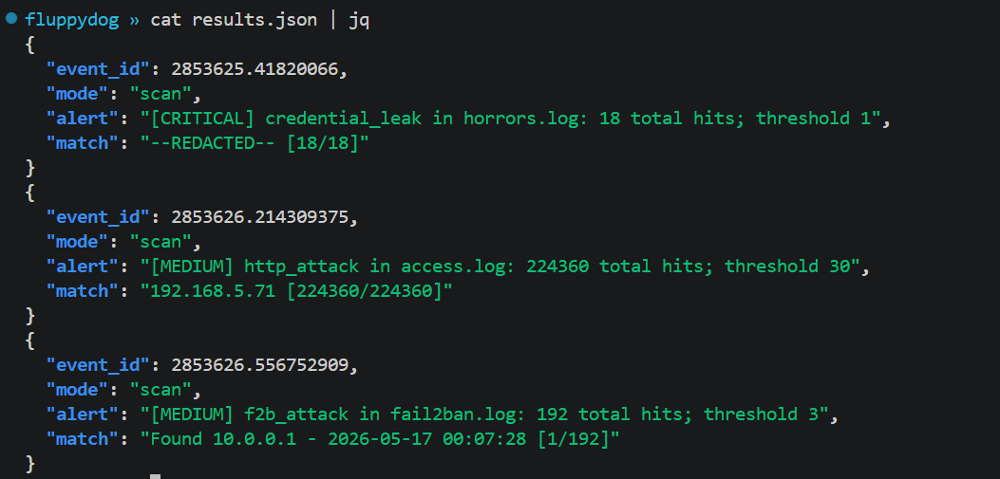

# FLUPPY DOG!

```
    @@@@@@@@ @@@      @@@  @@@ @@@@@@@  @@@@@@@  @@@ @@@
    @@!      @@!      @@!  @@@ @@!  @@@ @@!  @@@ @@! !@@
    @!!!:!   @!!      @!@  !@! @!@@!@!  @!@@!@!   !@!@!
    !!:      !!:      !!:  !!! !!:      !!:        !!:
    :        : ::.: :  :.:: :   :        :         .:
```

**`fluppy` is a standalone pattern-matching tool for log and file monitoring**

---
## Problem Definition

### Motivation

Monitoring and reviewing multiple logs or files on a system often requires either several terminal sessions, centralized logging infrastructure, or deployment of a full SIEM platform. These approaches may be impractical during incident response, on temporary systems, or within constrained environments.

`fluppy` was developed to provide a lightweight standalone utility capable of monitoring multiple files simultaneously using configurable rule-based pattern matching.

### Existing Approaches

Traditional approaches include:

- manually monitoring files using tools such as `tail`
- forwarding logs to centralized logging systems
- deploying SIEM platforms for aggregation and analysis
- using detection-oriented tools such as `yara` or `sigma`

While these approaches are effective in many environments, they often require additional infrastructure, deployment effort, or integration work.

### Gap Analysis

`fluppy` attempts to bridge the gap between simple command-line monitoring and heavyweight centralized tooling by providing:

- realtime monitoring of multiple files simultaneously
- portable standalone deployment
- lightweight YAML-based rule definitions
- rapid deployment during incident response or troubleshooting
- reusable and shareable detection rules

The tool may also function as a lightweight and temporary filesystem intrusion detection mechanism for specific use cases. One could even use `fluppy` to watch local files in security testing, for example with `burpsuite` to look for app errors or to hunt for developer comments (more findings, :)).


## System Design

### Architecture

`fluppy` consists primarily of:

- a standalone Python script
- a YAML configuration file defining monitoring rules

Rules define:

- file paths
- monitoring modes
- regular expression patterns
- thresholds
- actions
- redaction

`fluppy` continuously watches configured files and evaluates incoming lines against defined rules in realtime. Optionally, it can alert on existing files that have already been written. 

`fluppy` writes matches/events to `results.json` by default, but you can define what to write to via the `--output <filename.json>` flag.

### Technology Choices

Python was selected due to its portability, readability, and rapid development capabilities. YAML was selected for rule configuration because it is human-readable and easy to modify during live operations.

The implementation of `fluppy` was intentionally kept lightweight to support rapid deployment onto remote systems with minimal dependencies. At this time, the only external dependency is `PyYAML`. 


## Evaluation

### Test Environment

`fluppy` was tested primarily on Linux systems using a variety of real and synthetic log sources, including:

- Apache access logs
- fail2ban logs
- firewall logs
- syslog
- kernel logs
- arbitrary files containing contrived secrets

Testing focused on realtime monitoring behavior, rule matching, and multi-source visibility.

### Results

During practical testing, `fluppy` successfully monitored multiple files simultaneously and generated realtime console notifications when configured patterns matched incoming data.

The tool proved useful for quickly aggregating and reviewing activity from several independent log sources within a single console.

### Known Issues

Current limitations include:

- primarily text-oriented processing (log data, ASCII text)
- untested and limited support for binary data
- limited testing under extreme file rotation conditions
- no centralized storage or historical analysis capabilities

Future development efforts may address these limitations.


--- 
## About fluppy

Bring the `fluppy` dog to the fight. 

**fluppy** is a log tailing tool to identify patterns. It takes a YAML file, and a set of configurations within. `fluppy` attempts to be a "log watcher" for as many files as you can source. fluppy's main goal is to watch a number of files, and alert on patterns that you identify. 

`fluppy` generates "alerts" to standard out, rating them to a severity which you can specify. The idea here is that you might want to alert that someone is port scanning you or that segfaults are occurring in `kern.log`. `fluppy` has two modes currently, a "tail" mode to watch files in realtime, and a "scan" mode to hunt files that you want to search. 

Here are some screenshots of fluppy in action (some information is totally contrived, and others have been redacted to protect the guilty).





Also, `fluppy` defines alert thresholds and a cooldown period so as not to spam output constantly. 

### Use Cases

- Watch your firewall and your auth log at the same time
- Monitor your super special custom binary for segfaults
- Function like a cheap one-script IDS
- Alert on secrets in files acting like a cheezy DLP (and optionally redact them)
- Hunt your proxy logs for sensitive details or flaws

Currently, fluppy takes regular expressions which are then used to process logs (or really, any text file) for patterns. Examples include watching an Apache HTTP log for attacks, or monitoring a file for sensitive information. 

## Installation

You have two options.

1. Install `PyYAML` directly, then run `fluppy`.
2. Install `PyYAML` in a virtual environment (see note below).

**Option 1:**

Most of `fluppy` is pure Python, but you need to install `PyYAML`. You can get this working via `pip3 install PyYAML`. 

**Option 2:**
>**Note** In 2026, Python virtual environments are fairly standard practice. On some Linux distros and operating systems (like OSX), you might need a virtual environment to avoid breaking system packages. The suggested way forward is noted below. 

```        
$ python3 -m venv venv
$ source venv/bin/activate
$ python3 -m pip install PyYAML
$ python3 fluppy.py -h        # (shows help)
```

## Running fluppy

With `PyYAML` installed, `fluppy` should work for you to do some testing. 

`fluppy` currently has only 3 flags.

Flag|Purpose
----|-------
--config, -c|Specify the YAML file to run. "config.yaml" is the default and `fluppy` will try that first.
--verbose, -v|Print verbose output. Useful for seeing what rules `fluppy` matched.
--output, -o|Specify a logfile to write to. Writes to `results.json` by default.
--help, -h|Print the standard usage/help.

Thus, when you type `python3 fluppy.py -h`, you should get a screen similar to what is shown below.



You can start with the provided "config.yaml" file from this repo, but you will eventually want to modify the config to suit your needs. 

Rules look like the example below. In the example below, there is a "tail", which is a live following of the `access.log`, and a "scan" mode which simply searches the contents of a `kern.log` within proximity of the fluppy tool. 

```yaml
  - path: /var/log/apache2/access.log
    mode: tail
    rules:
      - name: http_live_attack
        regex: '((\d{1,3}\.){3}\d{1,3})'
        threshold: 10
        cooldown: 3
        window: 3
        severity: high

  - path: kern.log
    mode: scan
    rules:
      - name: segfault_monitor
        regex: '(segfault at)'
        threshold: 1
        cooldown: 300
        window: 1
        severity: critical

  - path: log_samples/horrors.log
    mode: scan
    rules:
      - name: credential_leak
        regex: '((BEGIN PRIVATE|KEY=|jdbc|redis|passwd:|password|pwd|token|root.+@|AKIA|amex|visa).+)'
        threshold: 1
        cooldown: 300
        window: 10
        severity: critical
        redact: True
```

Essentially, create the stanzas that you want, add a regular expression, a file source, and run `fluppy`.

After you have configured a YAML file, running it is simple.


Alternatively, the `-v` switch outputs more verbosely outputting recent lines matching the defined pattern.


Term|Purpose
---------|-------
path|This is the path to a file. It can be local to fluppy, or a full file path.
mode|**tail**: Live following of a source file (like the Unix "tail" utility)</br>**scan**: Search an existing dead file for patterns. 
rules|**name**: The rule name for your alert.<br/>**regex**: Configure the regular expression to search your files for. <br/>**cooldown**: The period of time in seconds that the tool should wait before alerting you again.<br/>**window**: The window of time that the tool should count events for. <br/>**threshold**: The number of events that should be counted within the **window**.<br/>**severity**: Currently expects severities like `critical`, `high`, `medium`, `low`, and `info`. These are used simply as color coding events streamed to the console.<br/>**redact**: Option to hide matches (e.g., passwords and such). Minimal effort! YMMV.

## Processing results

`fluppy` writes results to `results.json` by default. You can change its output log through the `--output` flag, alternatively. `fluppy` writes logs in JSONL format, and so tools such as `jq` will work swell. 



If you use the `--verbose` switch with `fluppy`, you will get more verbose events in your logs. At this time, it's doesn't go too crazy because well.. `fluppy` isn't meant to just "rewrite" logs after all. 


## About the name

Fluppy dogs have tails, and `tail` is pretty ubiqitous as a tool for "tailing" logs. Also I call my dog "fluppy dog" all the time, which is a portmanteau of "fluffy" and "puppy". You get it now.


