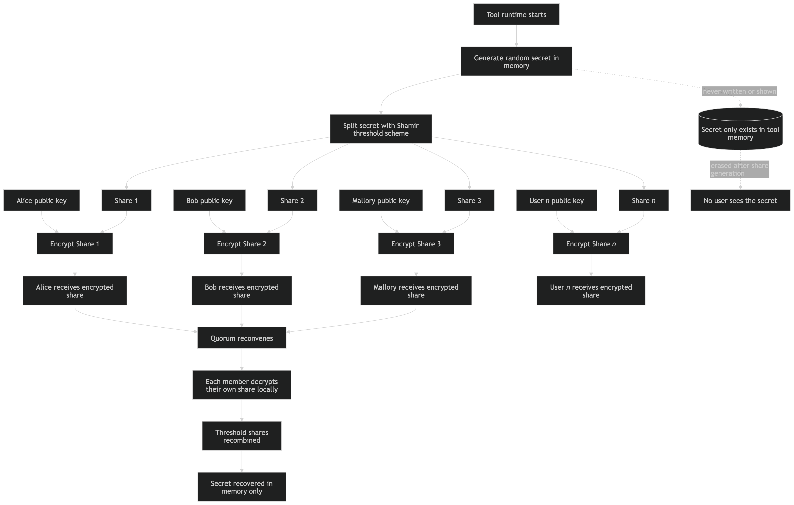
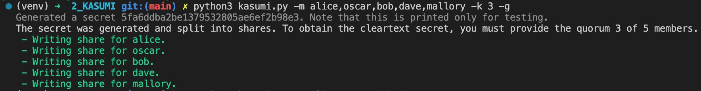
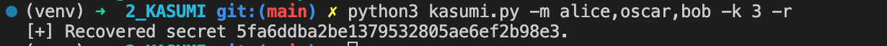
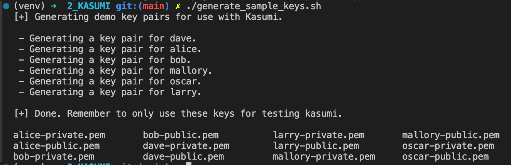

# Kasumi



Kasumi is a tool to generate a secret that is shared amongst a quorum of users. One use case might be in the generation of a very important secret for which no single user should be solely trusted with. A completely silly and fictional example might be the case of needing a missile launch code. It's an important secret, but we should not trust any single person to it. Instead, we can from a group (aka, a "quorum"), supply our public keys, supply them to the system which generates a secret for each of us. Since each of us now hold only a part of a secret, it requires some *k(n)* (e.g., 3 out 5 of us) of us to reconvene to obtain the full secret. 


This system has the properties and goals:

- No single user can know the entire secret.
- Prevents some basic "rubber-hose" cryptanalysis because it requires several of us to get the secret.
- No single user can obtain the secret without collusion (and thus, we ideally select a lareg enough group).
- Assembles the secret quickly when we have that "break glass" moment.

An ideal implementation would be key generation inside of a hardware security module, but for this example, we'll just do that in Docker and pretend. :)

## Implementation

I used Shamir's Secret Sharing algorithm to carve up some distribution which we define. We might say that we want 5 members in our quorum, and that 3 of them need to be present to get the secret. 

It should work like this:

1. Dave, Alice, Bob, Mallory, and Oscar form a group/quorum. They don't even need to know each other. It might be better if they don't know each other. A motivated adversary attempting to coerce one of us into providing the secret will then be useless.
2. Each member of the quorum generates a key pair by which their part of the encrypted share will be protected. In the real world, the ideal case is that each member of the quorum creates a really strong password on their own keys. 
3. Each member supplies their public key to an opaque system (i.e., a service of some kind). This could be a Docker container, a web service, or a hardware security module, depending on needs. Obviously this system needs to be as secure as we could make it. It is not the goal of this work to ensure perfect security or to belabor the points of how this could go wrong.
4. After each member supplies their public key, the opaque system generates a secret, splits the secret into shares, encrypts the secret with each member's public key, and returns the encrypted shares. It is not really important to protect these encrypted shares in this proof, although it could be designed so that each person only sees their share of the secret.
5. Each member holds each share of the secret. If they need the actual secret, a quorum of the members reconvene, supply their share, and obtain the ultimate result. This could technically be built so that none of the users ever see the secret - in fact, if the point was to take an action on behalf of the group, it wouldn't even be necessary. 

## Installation

This tool requires the Python modules:

- cryptography 
- pycryptodome

1. Use a virtual environment, then install modules via `pip`.

```
$ python3 -m venv venv
$ source venv/bin/activate
$ python3 -m pip install -r requirements.txt
```

2. Run it! Here is an example **generating** a secret for a 5-member quorum. In this example, it takes **3** members to obtain the cleartext secret.



3. Reconvene with **3 out of 5** members to reveal the secret. 



> Note that in the real world, you might not want to reveal the secret at all, but carry out some function that the system is capable of on its own.

4. As expected, a quorum of less than designed will return an invalid secret. This has the attribute of being somewhat "rubber hose cryptanalysis" resistant.


For testing, you can run the `generate_sample_keys.sh` shellscript to create RSA key pairs for 5 users which can be used to help evaluate this tool.




### Flags

Run `python3 kasumi.py -h` to get started. You should see these flags.

Flag|Meaning
----|-------
-m,--members|A comma delimited list of members. e.g., `alice,oscar,bob,dave,mallory`. <br />These users **MUST** have associated keypairs named as `user-public.pem`, `user-private.pem` in the local directory. 
-g, --generate-shares|Generates a secret and encrypts that secret with each of the member public keys.
-r, --recover-shares|Recovers sharefiles provided to the tool. Each of the member private keys, and member sharefiles **MUST** exist, e.g., `mallory-share`.
-k, --threshold|The number of quorum members necessary to decrypt the secret. 
-h, --help|Help information.


## AI Usage

AI didn't generate this code.

- Search engines "helpfully" presented some answers to queries.
- Most of this was with regard to error handling, or some syntactic issue.
- AI *did* generate the Mermaid flowchart shown at the top of this documentation.

