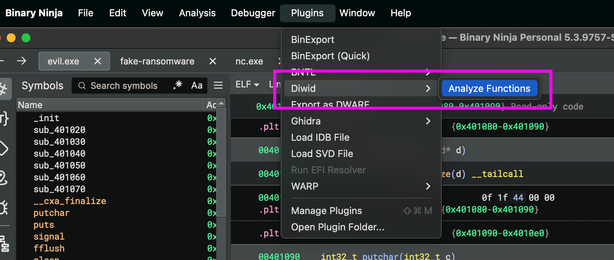
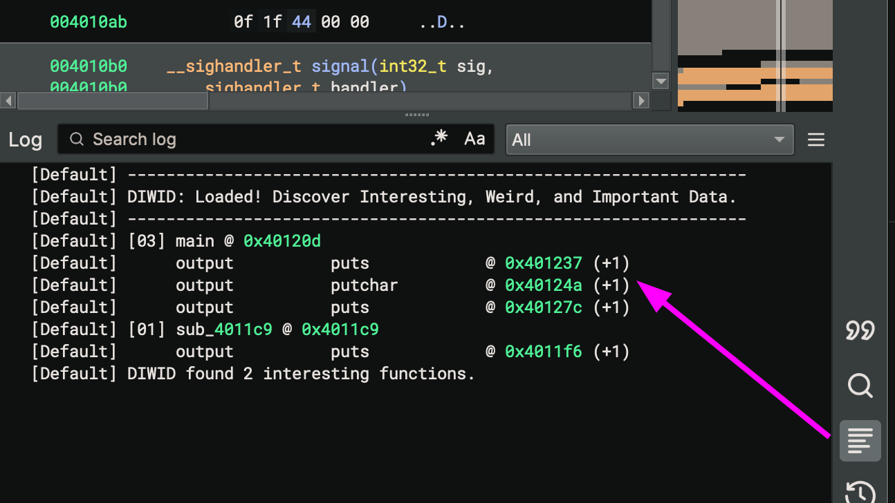
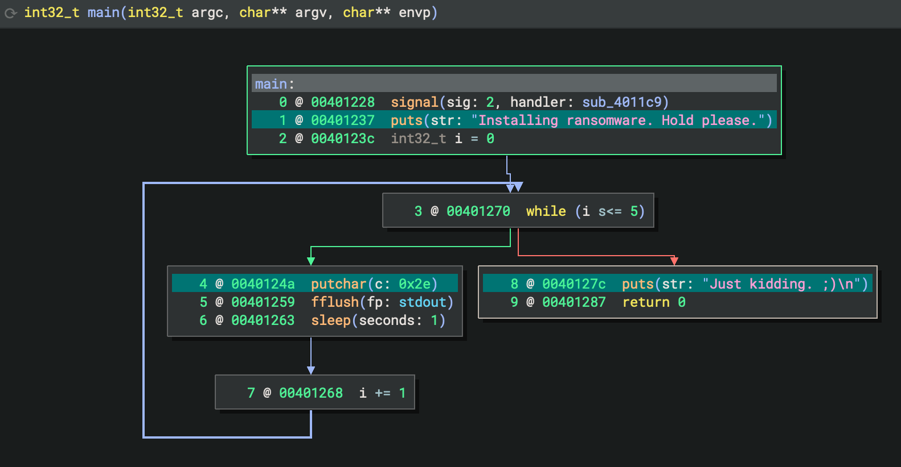
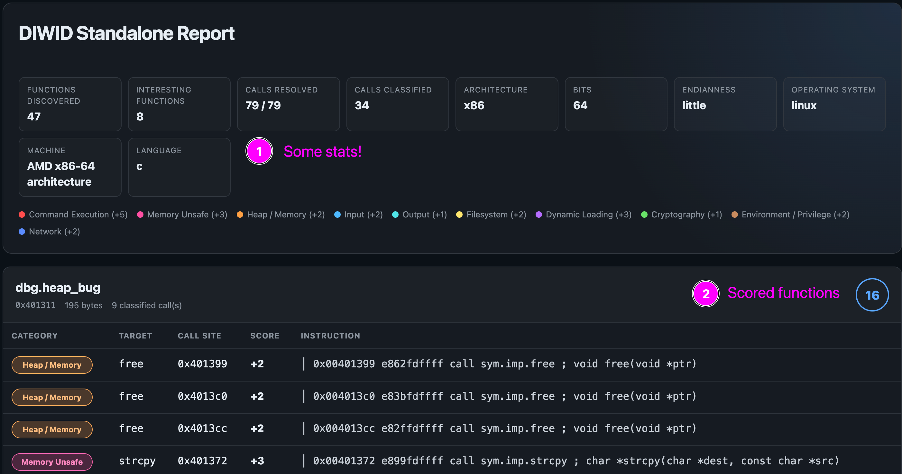

# DIWID - Discover Interesting, Weird, and Important Data

DIWID is a Binary Ninja plugin to help reverse engineers *Discover Interesting, Weird, and Important Data*. 

> NOTE: The primary implementation is a Binary Ninja plugin. Because Binary Ninja Free does not support plugins, a lightweight Linux ELF standalone reporter is included so reviewers can evaluate DIWID’s scoring model without commercial tooling. It leverages  [radare2](https://github.com/radareorg/radare2) framework under the hood which makes it interesting on its own. 

- Binary NInja version - Tested on Linux and OSX
- Standalone version - Tested on Linux only

## Problem 

When working through software exploitation and reverse engineering scenarios, it is helpful in my experience to locate functions that are commonly associated with software vulnerabilities. DIWID tries to locate functions and to highlight them by severity. The severity is subjective, and opinions might differ. Regardless, DIWID functions to help identify these functions and highlights them for follow up.

When working through binaries in reverse engineering, it can certainly be a time saver to more quickly zero-in on places to look. If you are working in the field, the identification of vulnerabilities can help protect organizations and help offensive security professionals move faster. Vulnerability triage simply reduces cognitive load on an already difficult task.

Other tools likely exist, though I am not aware of anything that performs exactly this function. The gap that this tool attempts to solve is to visually identify areas of code that could be useful in software exploitation. 

## Design
- System Design  
- High level architecture of your tool  
- Technology choices and justification  

Currently this tool is authored in Python and leverages Binary Ninja's Python API. You will need Binary Ninja in order to get this plugin working and to use it effectively. I did make an effort to "ignore" certain usual functions - like it doesn't necessarily make a ton of sense to crawl through libc. Instead, the tool tries to stay within the boundaries of what are the critical functions to assess. 

Given a function like `free()`, a chosen color is used to highlight that function. Functions that have a long history of exploitation are highlighted accordingly (e.g., `strcpy()`).

## Evaluation

Sample binaries from CTFs were used as input to Binary Ninja along with this plugin to test how it worked. In general, the plugin works as expected and does locate various functions in a given binary worth exploring further. 

> Note: DIWID targets the Binary Ninja Python Plugin API. Binary Ninja Free sadly does not expose the plugin API. The plugin has been tested with Binary Ninja 5.3 Personal.


## Installation

**There are currently two options.**

1. The Binary Ninja Plugin that requires a licensed (PAID) version of Binary Ninja.
2. The standalone Python script that produces an HTML file of similar output.

### Option 1. Binary Ninja Plugin

1. Install [Binary Ninja](https://binary.ninja/free/) for your OS. Again, you must have a paid license of Binary Ninja.
2. Clone the Git repo.

```bash
➜  git clone https://github.com/0xffe49090/GBBZNALFRPERGF
Cloning into 'GBBZNALFRPERGF'...
```

3. Change directories into the `3_DIWID` folder. 

```
➜  cd GBBZNALFRPERGF/3_DIWID
```

4. Copy the **entire DIWID folder** into your Binary Ninja plugins folder (e.g., `~/Library/Application Support/Binary Ninja/plugins/diwid` on OSX). See "Notes" below for your OS.

```bash
➜  3_DIWID git:(main) cp -r diwid_binaryninja ~/Library/Application\ Support/Binary\ Ninja/plugins
```

4. Start up Binary Ninja. 
5. Navigate over to `Plugins >  DIWID > Analyze Functions`.



6. Review the output in the log.



7. Check the colorized output noting interesting and potentially suspect functions for review. The screenshot below shows a blue-green color assigned to functions like `puts` and `putchar` for example. 



**Notes**

For details on installing on your operating system, see https://docs.binary.ninja/guide/plugins.html. 

Taken straight from the above reference, put the plugin in the appropriate folder and restart Binary Ninja.

- macOS: `~/Library/Application Support/Binary Ninja/plugins/`
- Linux: `~/.binaryninja/plugins/`
- Windows: `%APPDATA%\Binary Ninja\plugins`


### Option 2. Standalone  Version

If you do not have a licensed (aka "PAID") version of Binary Ninja, the only option in this repo is the standalone version. It merely produces a color-coded mapping and scoring of identified functions. This standalone version uses the very awesome [radare2](https://github.com/radareorg/radare2) to discover functions, imports, xrefs, etc.

**Requirements:**

- radare2
- binutils

I strongly recommend that you start by cloning the radare2 latest and then building it yourself. It's fairly quick and easy.

```
$ git clone https://github.com/radareorg/radare2
$ cd radare2
$ sys/install.sh
```
Next, make sure you have `readelf` and `objdump`, etc. 

```
$ sudo apt update && sudo apt install binutils
```

**Get started with the standalone version**

Now with the requirements out of the way, get started. 

1. Clone the repo. 
2. Run the standalone `diwid_standalone.py` version against the sample binary.

```
$] python3 diwid_standalone.py sample.bin -o diwid.html --json diwid.json --debug
[debug] discovered functions : 47
[debug] imports              : 15
[debug] flags                : 187
[debug] import targets       : 43
[debug] classified imports  : 33
[debug] matching xrefs       : 79
[debug] classified callsites : 34
[debug] interesting functions: 8
DIWID Standalone 0.3.0
Binary: sample.bin
Functions: 47 discovered, 8 interesting
Calls: 79/79 resolved, 34 classified

Score  Address         Function                          Findings
------------------------------------------------------------------
   16  0x401311        dbg.heap_bug                      9
       0x401399        heap                     free (+2)
       0x4013c0        heap                     free (+2)
       0x401372        memory_unsafe            strcpy (+3)
       0x401355        output                   puts (+1)
       0x401326        heap                     malloc (+2)
       0x401334        heap                     malloc (+2)

   12  0x401437        dbg.struct_bug                    6
       0x4014e4        heap                     free (+2)
       0x401492        memory_unsafe            strcpy (+3)
       0x4014a9        memory_unsafe            strcpy (+3)
       0x40146a        output                   puts (+1)
..
```

3. Look at the generated HTML report. From the command above, the resulting `diwid.html` file is opened in a web browser to produce output similar to the following.



### Colorization and Ratings

An effort was made to colorize in a sane way, but it is certainly debatable. 

The table below shows how functions will be colorized and scored. For example, a function found within the "Command Execution" category will be colored red and given a +5 score.

Hacking on this ought to be fairly trivial as the Python code can be easily modified.

|Category|Color|Score|Purpose|
|---|---|--:|---|
|Command Execution|Red|**5**|Process creation, shell execution, and code execution primitives|
|Memory Unsafe|Hot Pink|**3**|Common memory corruption and overflow-related APIs|
|Heap / Memory Management|Orange|**2**|Dynamic memory allocation and virtual memory management|
|Input|Sky Blue|**2**|Data entering the application (file, network, or user input)|
|Output|Cyan|**1**|Data leaving the application (console, network, or files)|
|Filesystem|Yellow|**2**|File creation, deletion, and modification|
|Dynamic Loading|Purple|**3**|Runtime library loading and dynamic symbol resolution|
|Cryptography|Bright Green|**1**|Encryption, hashing, and cryptographic operations|
|Environment / Privilege|Brown|**2**|Environment variables and privilege manipulation|


## AI Usage 

**Binary Ninja Plugin Documentation** 

I started by reading the documentation and through testing a few basic ideas with Binary Ninja.

- https://docs.binary.ninja/dev/plugins.html#creating-the-plugin (Creating plugins)
- https://github.com/Vector35/sample_plugin (Binary Ninja Sample Plugin from Vector35)

Upon getting the hang of how development and plugins are implemented, I used AI as a development assistance to come up with the bones of the software. I modified and changed various sections for my own desired formatting, and reviewed and tested the code.

The "diwid_standalone.py" is almost entirely AI generated (however was based on the Binary Ninja plugin code) as a necessity to support unlicensed Binary Ninja installations. It was tested and reviewed. 
