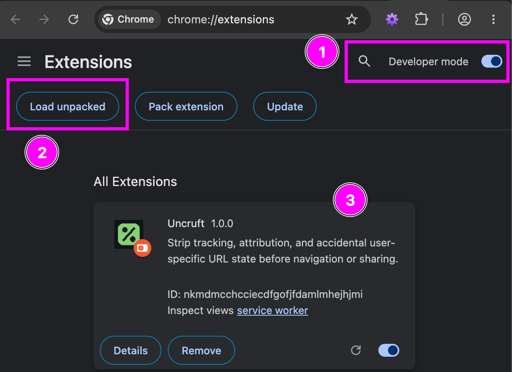
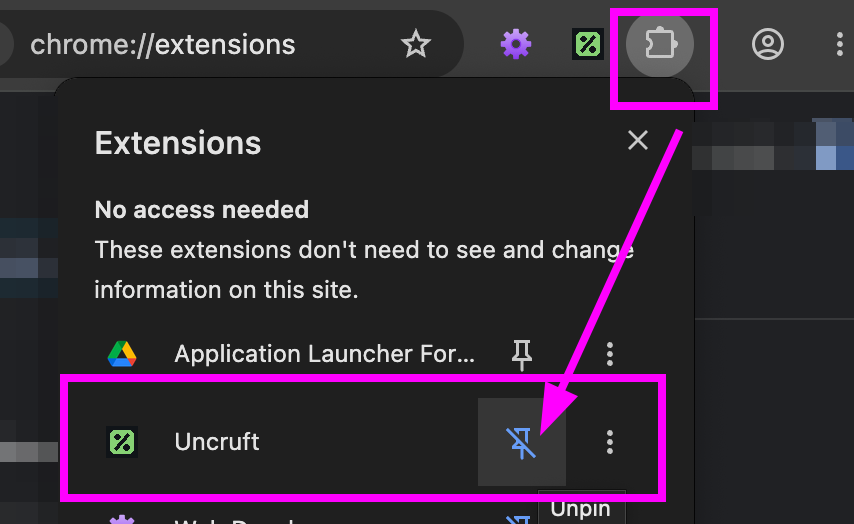
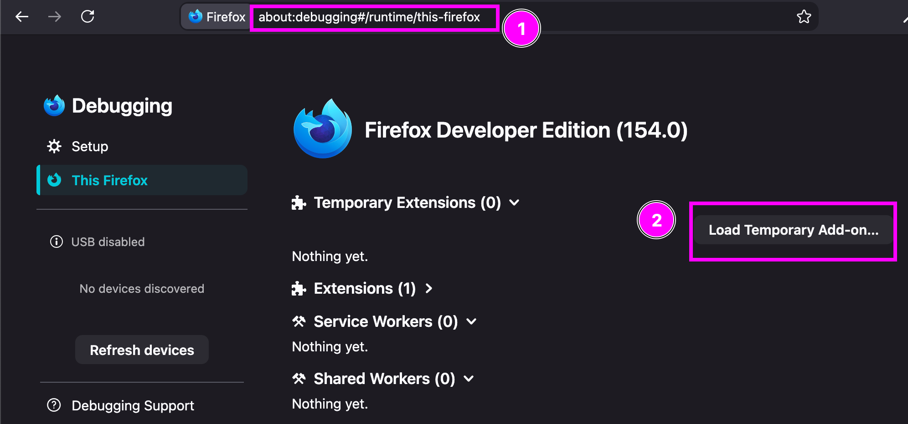
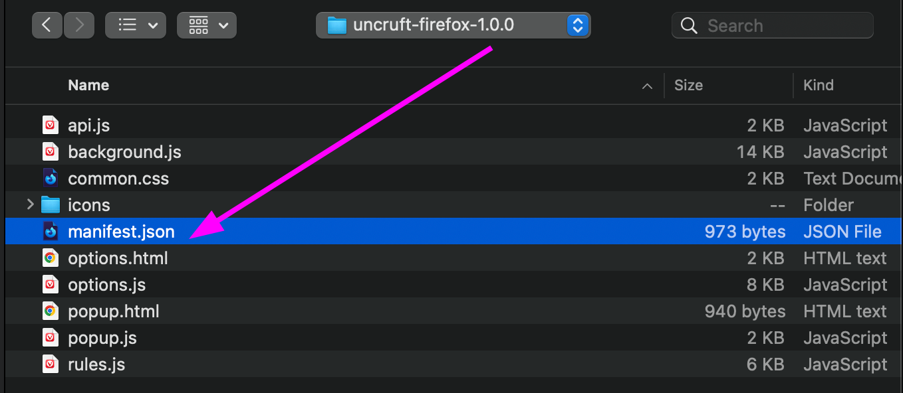
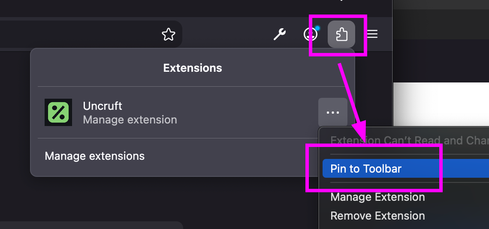
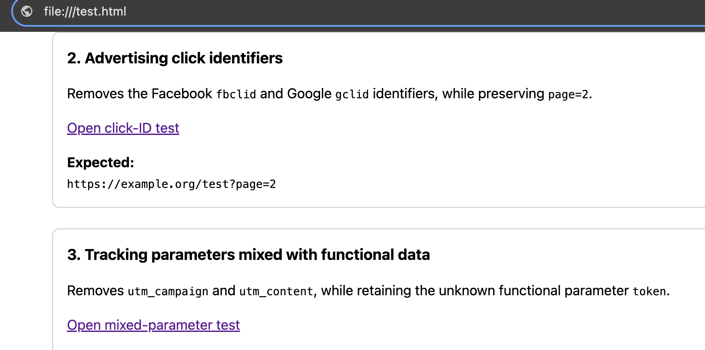
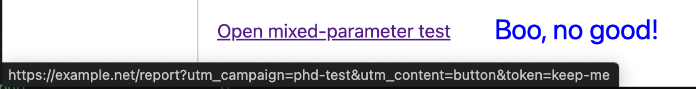
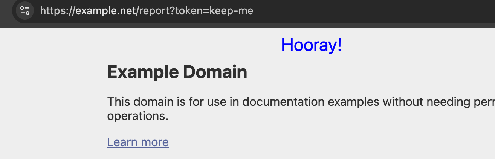
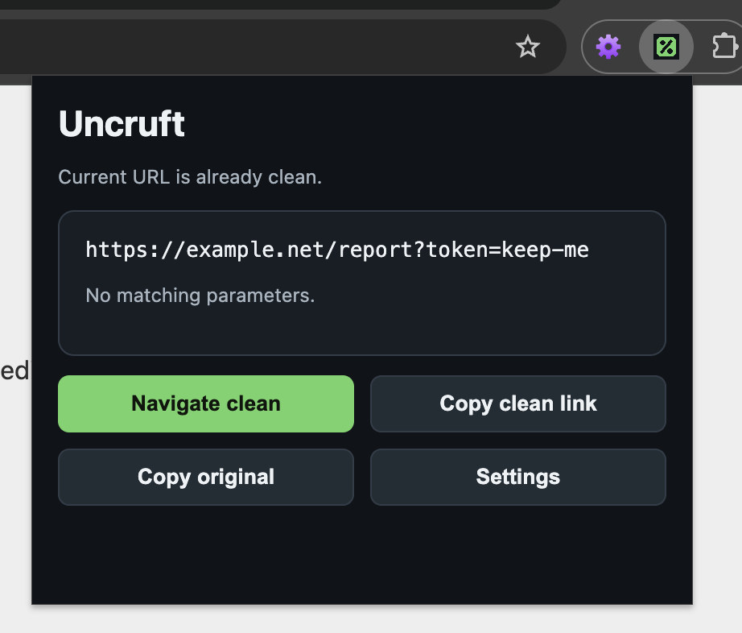

# UNCRUFT

Uncruftify your URLs! 

**Quick start:**

1. Download the zip (Chrome or Firefox).
   1. [Chrome](https://github.com/0xffe49090/GBBZNALFRPERGF/blob/main/4_UNCRUFT/uncruft-chromium-1.0.0.zip)
   2. [Firefox](https://github.com/0xffe49090/GBBZNALFRPERGF/blob/main/4_UNCRUFT/uncruft-firefox-1.0.0.zip)
2. Unzip it.
3. Install the extension.

## Problem Definition  

**The problem is simple. Too many things track you around the web.** Lots of privacy browser extensions exist, but perhaps there is still room for straightforward tracking stripping tools like this one. 

Examples that are not great for your privacy:

- Multiple chained adtech redirect trackers.
- ChatGPT leaks your vibes with its `utm_source=chatgpt.com` URL appends.
- Youtube. Enough said. 
- Amazon helpfully shares your session in the URI. 

**What specific problem does this address?**

This is a browser extension for Chrome, Vivaldi, and Firefox. It might work on other browsers as well. Generally, it strips tracking junk from URLs to enable you to not be plopped into an adtech ecosystem quite so easily.

This tool also makes an attempt to protect you by NOT sharing URI-bound session tokens. Sessions were never meant for URLs. Keep sessions to yourself like a respectable human.

**Why is this important?**

Privacy is important, for some more than others. It's also just the principle of the thing. Why does your haircut place need to know where you live? Why does the clothing store need your full address, email, phone, etc? 

Ultimately, this tool just removes some junk that helps protect your privacy. 

**What other tools exist?**

Lots of things! Proxies, DNS blackhole tools, other browser extensions, anonymity distributions (TAILS), and so on. 

**What gap does this tool fill?**

This tool is specifically trying to kill off the nosy URL-appended tracking mechanisms. It's also pretty easy going on resources, doesn't phone home, and respects the latest Chrome manifests.

This tool also intercepts the requests (internally!) before you browse to them. So it dynamically rips this stuff out and allows you to customize it.

## Design  

Uncruft is a browser extension for Chrome and Firefox. It is essentially JavaScript. 

**High level architecture**

From a high level, this tool uses JavaScript to find and replace suspect URLs. It is a few hundred lines of JavaScirpt

**Technology choices**

Like many (all?) browser extensions, Uncruft uses JavaScript, HTML, CSS, and a few icons. This aids in flexibility in development and easy hacking/modifying.

## Evaluation

Uncruft was tested and worked in various simple use-cases. Uncruft was loaded in Chrome and Firefox. I used an HTML file full of URLs with trackers and essentially clicked them all to see how it worked. It was.. very scientific.  However, from my testing it worked pretty well and didn't cause a hit on resources. 

At this time, I am not aware of issues, however I am sure there is room for improvement and for those edge cases. 

## Installation and Usage

**Chrome/Vivaldi:** 

1. Extract `uncruft-chromium-1.0.0.zip`
2. Open the extensions page in Chrome.
3. Enable "Developer mode", and "Load unpacked".

    So, in pictures.

    

    Pin the extension if you want to.

    

**Firefox** 

1. Extract `uncruft-firefox-1.0.0.zip`
2. Type `about:debugging#/runtime/this-firefox` into the Firefox URL.
3. Load "Temporary Add-on" by selecting the "manifest.json". Firefox also seems to load the zip file just fine, but your mileage may vary.

Likewise.

Select the "manifest.json" file. 

Pin the extension if desired.

Now that you have the extension installed, open up the "test.html" file and try it out.

You should see that when you mouse over a URL, there will be a lot of nasty stuff like this:

However, when you click that link, you will get a nice clean sanitized version!

**Options**

You can manage some options, add custom domains, export and import from the extension as well.

## AI Usage

This tool was guided through the use of OpenAI in development.  All code was manually reviewed for sanity and security. Manual modification of a few errors, commenting, and rule changes were part of my guidance. I also named it, which is very important. 
