# UNCRUFT

A browser extension to remove junk from URLs.

**Quick start:**

1. Grab the zip for your browser and unzip it.
   1. [Chrome/Vivaldi](https://github.com/0xffe49090/GBBZNALFRPERGF/raw/refs/heads/main/4_UNCRUFT/dist/uncruft-chromium-1.1.0.zip)
   2. [Edge](https://github.com/0xffe49090/GBBZNALFRPERGF/raw/refs/heads/main/4_UNCRUFT/dist/uncruft-edge-1.1.0.zip)
   3. [Firefox](https://github.com/0xffe49090/GBBZNALFRPERGF/raw/refs/heads/main/4_UNCRUFT/dist/uncruft-firefox-1.1.0.zip)
2. Open your target browser, enabling developer mode for testing.
3. Install the extension by pointing to the appropriate folder.

Read the [installation instructions](#installation-and-usage) for more info.

**Simple test**

Goal: Avoid leaking that I collect all of my bird research references with ChatGPT.

Copy this and paste it in. 

* `https://www.press.jhu.edu/books/title/9274/ducks-geese-and-swans-north-america?utm_source=chatgpt.com`

Provided you have the extension installed, you should get this as the final URL.

* `https://www.press.jhu.edu/books/title/9274/ducks-geese-and-swans-north-america`

Hooray! No one knows you AI everything.

---

**UPDATE v1.1.0**

I added some new functionality and changes at the request of some of my peers. 

1. **Uncruft's self-test mode.**

You can now just use the UI, select the extension, and choose the "Run self-test".

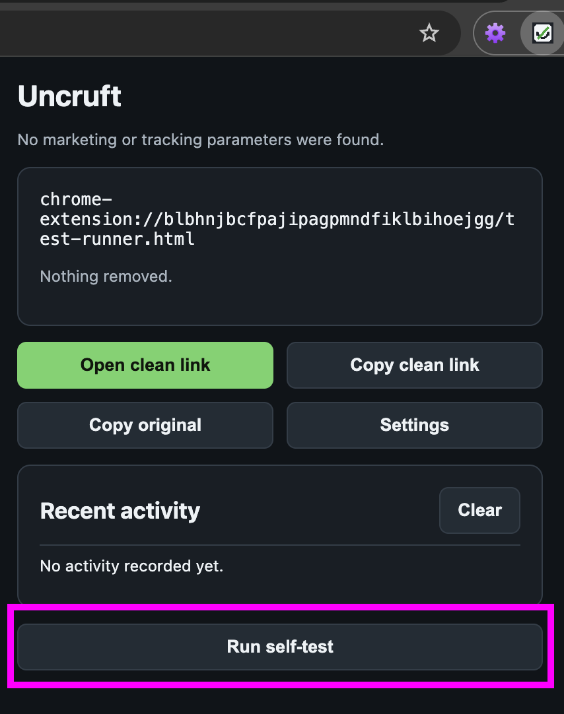

You'll get something like follows.

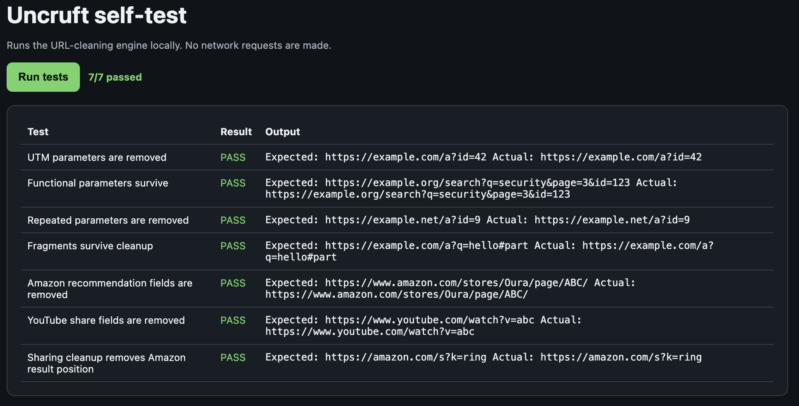

2. **Clarity in what Uncruft does.** Simply select the Uncruft icon in your browser and view the "Recent Activity". Uncruft currently stashes the last 50 sites browsed to.

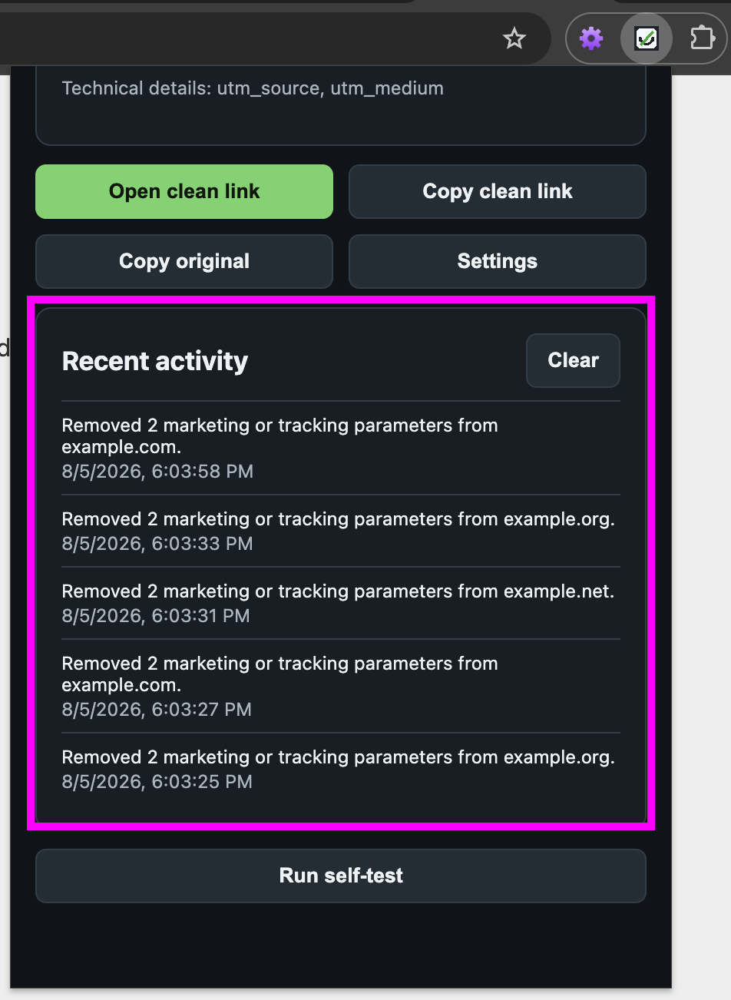

3. **A Microsoft Edge version.** It should similar to installing in Chrome, but just scrolldown to read about it. 

4. **Installation should be easier.** I hope so, anyway. Just download the zip appropriate for your browser and follow the instructions below. This is not yet in the various extension stores, and so for the time being, you will have to enable developer mode for testing it out.

----

## Problem Definition  

**The problem is simple. Too many things track you around the web.** Lots of privacy browser extensions exist, but perhaps there is still room for straightforward tracking stripping tools like this one. 

Examples that are not great for your privacy:

- Multiple chained adtech redirect trackers.
- ChatGPT leaks your vibes with its `utm_source=chatgpt.com` URL appends.
- Youtube. Enough said. 
- Amazon helpfully shares your session in the URI. 

**What specific problem does this address?**

This is a browser extension for Chrome, Vivaldi, and Firefox. It might work on other browsers as well. Generally, it strips tracking junk from URLs to enable you to not be plopped into an adtech ecosystem quite so easily.

This tool also makes an attempt to protect you by NOT sharing URI-bound session tokens. Sessions were never meant for URLs. Keep sessions to yourself like a respectable human.

**Why is this important?**

Privacy is important, for some more than others. It's also just the principle of the thing. Why does your haircut place need to know where you live? Why does the clothing store need your full address, email, phone, etc? 

Ultimately, this tool just removes some junk that helps protect your privacy. 

**What other tools exist?**

Lots of things! Proxies, DNS blackhole tools, other browser extensions, anonymity distributions (TAILS), and so on. 

**What gap does this tool fill?**

This tool is specifically trying to kill off the nosy URL-appended tracking mechanisms. It's also pretty easy going on resources, doesn't phone home, and respects the latest Chrome manifests.

This tool also intercepts the requests (internally!) before you browse to them. So it dynamically rips this stuff out and allows you to customize it.

## Design  

Uncruft is a browser extension for Chrome and Firefox. It is essentially JavaScript. 

**High level architecture**

From a high level, this tool uses JavaScript to find and replace suspect URLs. It is a few hundred lines of JavaScirpt

**Technology choices**

Like many (all?) browser extensions, Uncruft uses JavaScript, HTML, CSS, and a few icons. This aids in flexibility in development and easy hacking/modifying.

## Evaluation

Uncruft was tested and worked in various simple use-cases. Uncruft was loaded in Chrome and Firefox. I used an HTML file full of URLs with trackers and essentially clicked them all to see how it worked. It was.. very scientific.  However, from my testing it worked pretty well and didn't cause a hit on resources. 

**Known Issues**

At this time, I am not aware of issues, however I am sure there is room for improvement and for those edge cases. It is definitely not a perfect privacy tool, either. Don't bet the farm on perfect software. 

## Installation and Usage

1. Download the appropriate zip for your browser.
   1. [Chrome/Vivaldi](https://github.com/0xffe49090/GBBZNALFRPERGF/raw/refs/heads/main/4_UNCRUFT/dist/uncruft-chromium-1.1.0.zip)
   2. [Edge](https://github.com/0xffe49090/GBBZNALFRPERGF/raw/refs/heads/main/4_UNCRUFT/dist/uncruft-edge-1.1.0.zip)
   3. [Firefox](https://github.com/0xffe49090/GBBZNALFRPERGF/raw/refs/heads/main/4_UNCRUFT/dist/uncruft-firefox-1.1.0.zip)

2. Unzip the folder.

**Chrome/Vivaldi:**

1. Open the extensions pane in your browser.
2. Enable "Developer mode".
3. Choose "Load unpacked" and select the folder you unzipped.
4. 
    So, in pictures.

    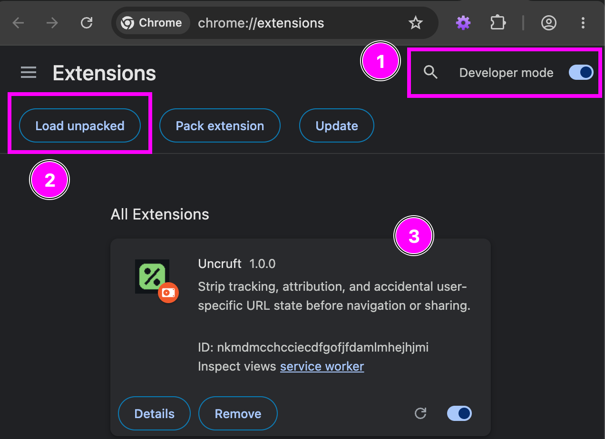

    Pin the extension to expose its functionality. 

    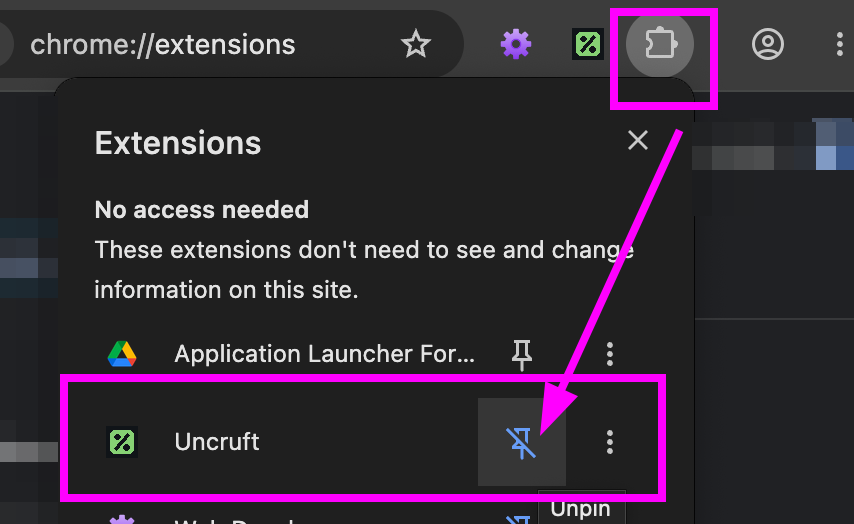

**Firefox** 

1. Type `about:debugging#/runtime/this-firefox` into the Firefox URL.
2. Load "Temporary Add-on" by selecting the "manifest.json" by choosing the folder where you unzipped the extension.

    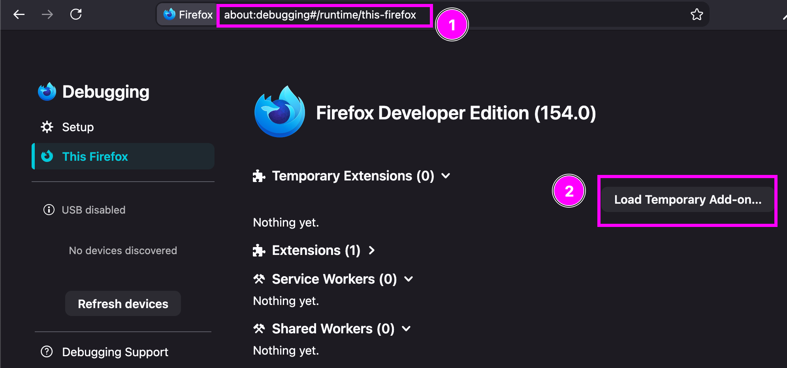

    Select the "manifest.json" file. 

    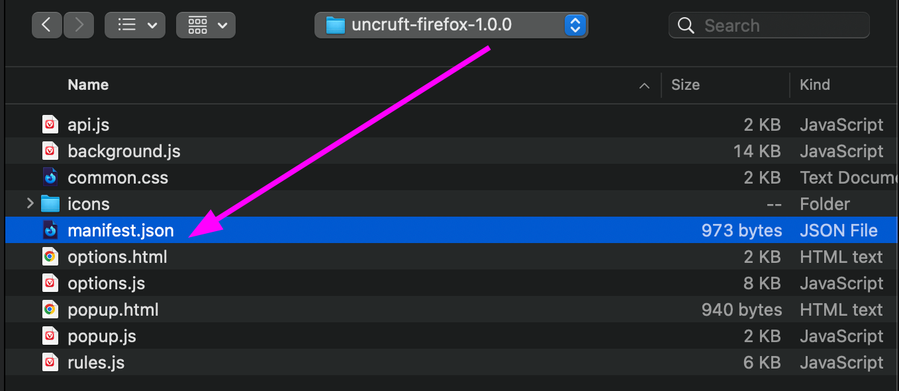

    Pin the extension to expose its functionality. 

    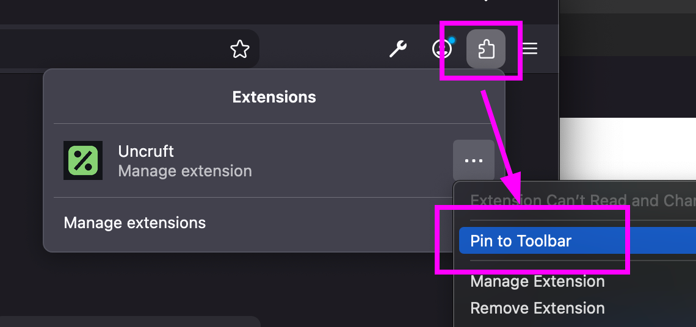

**Microsoft Edge**

1. Clone the repo.
2. Navigate to the Extensions menu.

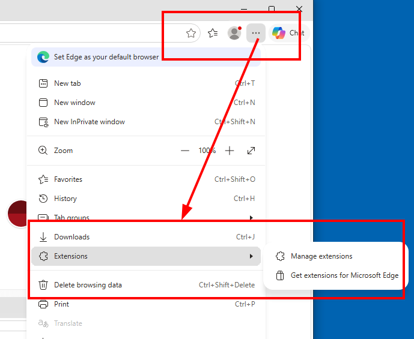

3. Enable Developer Mode.

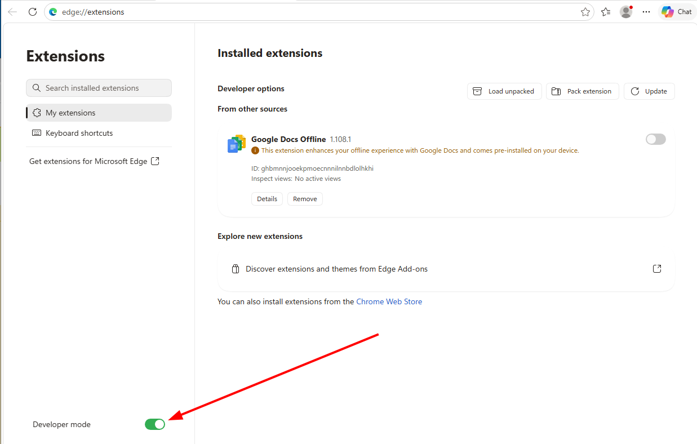

4. Select "Load Unpacked".

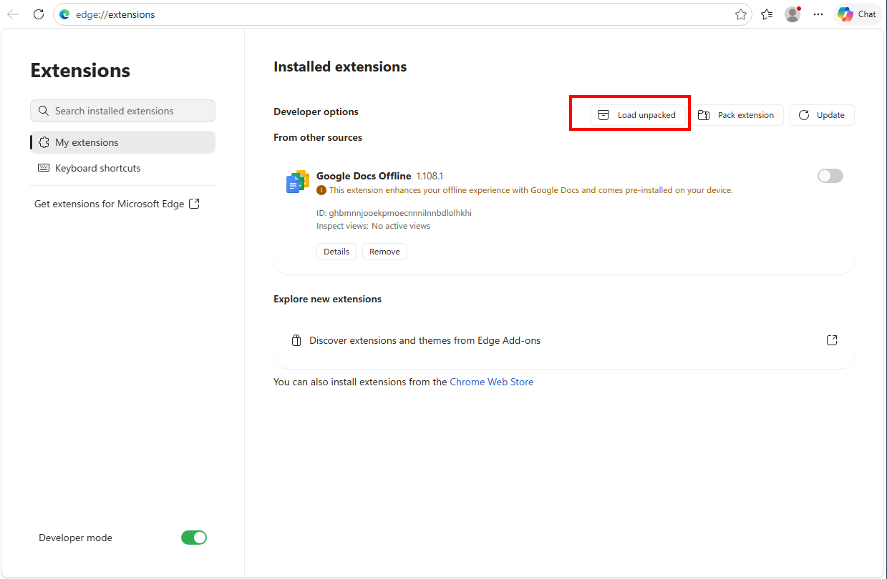

5. Pin the extension to expose its functionality. 

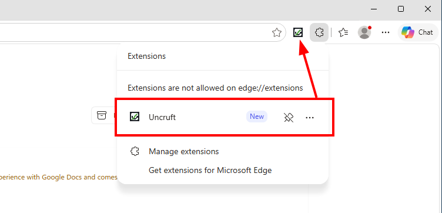

**Options**

You can manage some options, add custom domains, export and import from the extension as well.

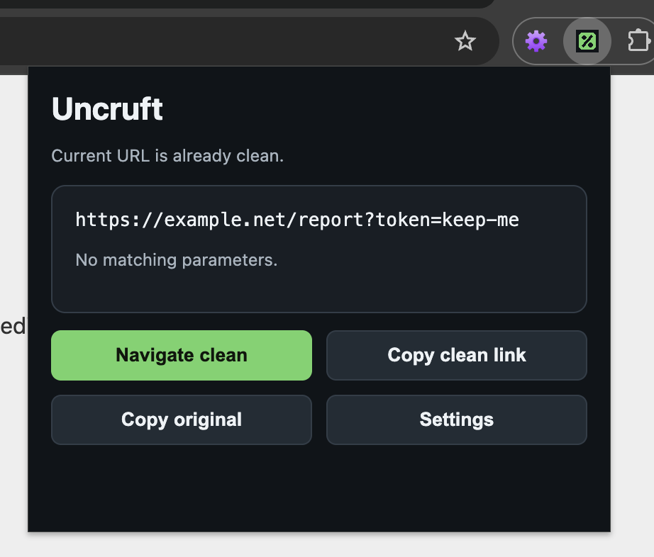

## Testing the Extension

Ideally the extension will work the same in any supported browser. Essentially, after you have installed the extension, simply select Uncruft's icon in the browser, and choose "Run self-test".

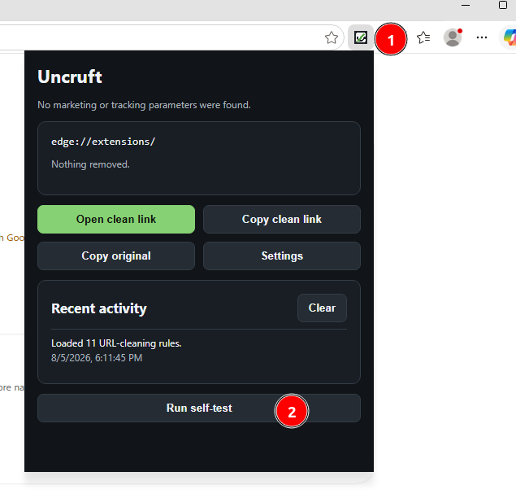

From there, just navigate around the web normally and see how it works. 

**Additional testing**
There is an HTML test file in this repository as well. This can be helpful if you want to see what Uncruft does and to test out its logging functionality.

Now that you have the extension installed, try surfing with it a bit, or open up the "[test-links.html](https://github.com/0xffe49090/GBBZNALFRPERGF/blob/main/4_UNCRUFT/tests/test-links.html)" in a browser from the source code "tests" folder and try that out.

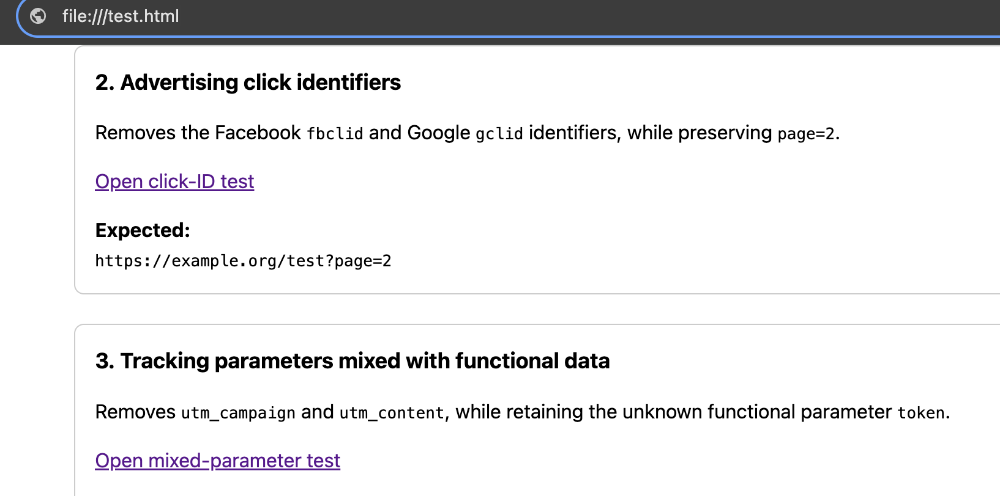

You should see that when you mouse oever a URL, there will be a lot of nasty parameters like this screenshot shows:

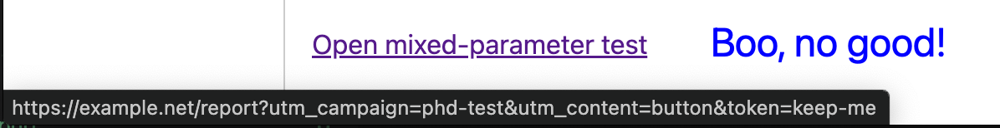

However, when you click that link, you will get a nice clean sanitized version!

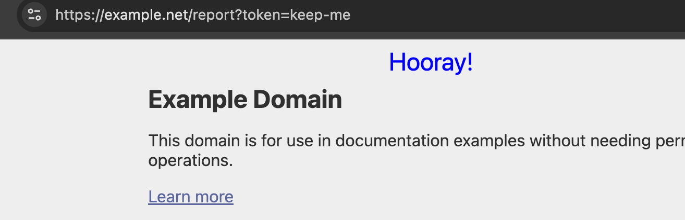

## AI Usage

This tool was guided through the use of OpenAI in development.  All code was manually reviewed for sanity and security. Manual modification of a few errors, commenting, and rule changes were part of my guidance. I also named it, which is very important. 
